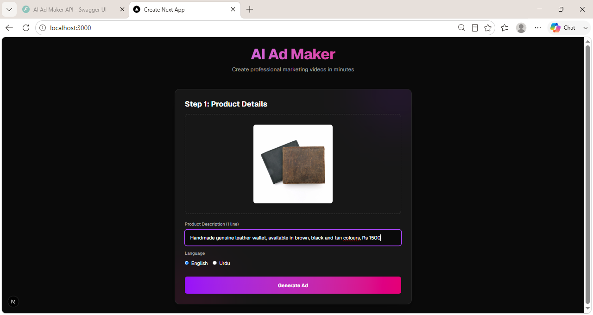
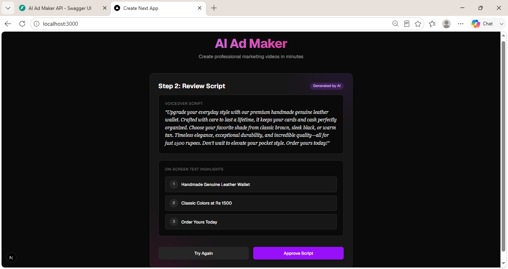
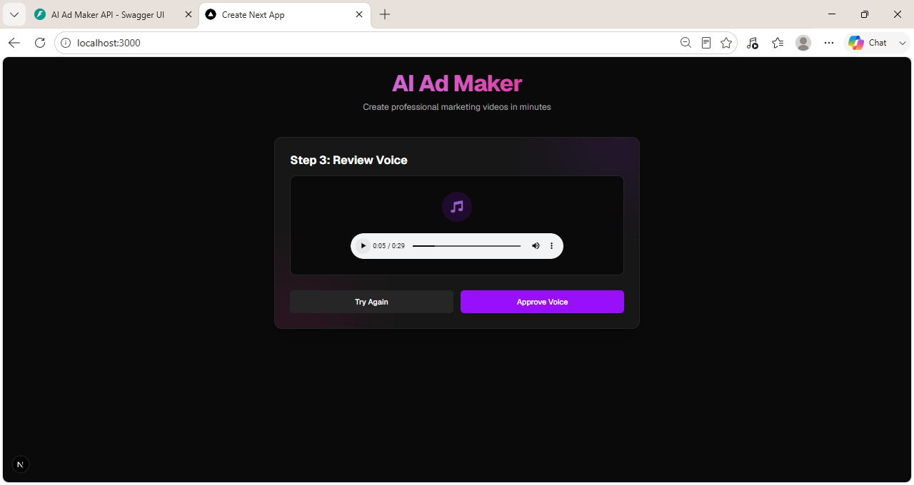
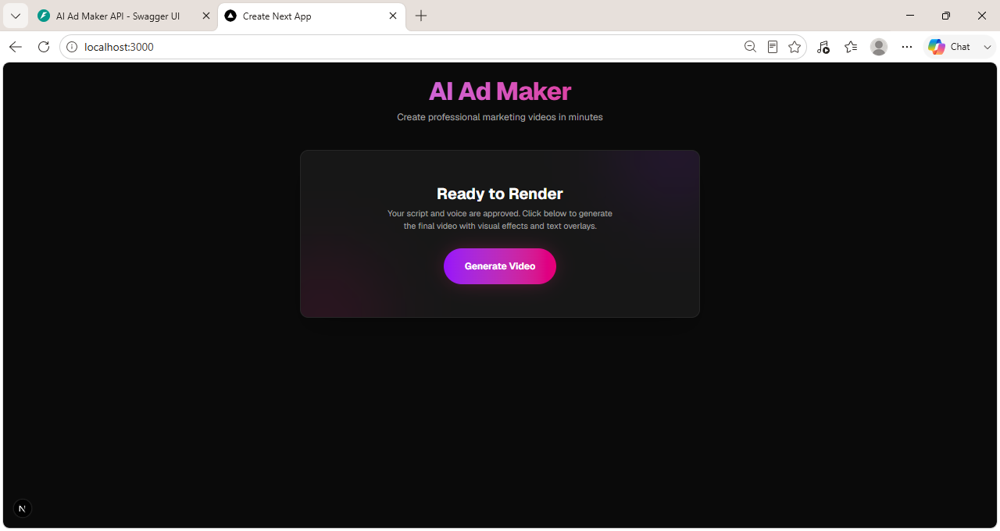
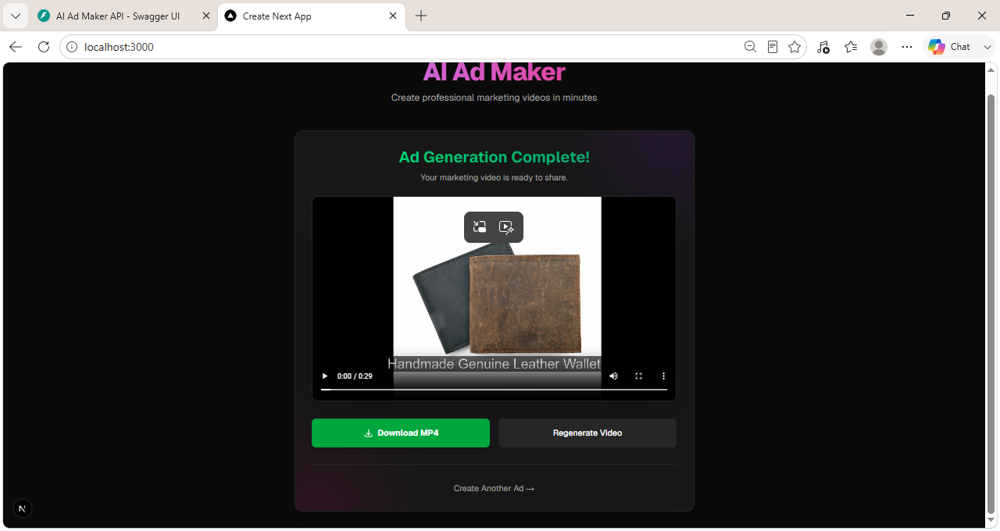

# AI Ad Maker For Small Shops

**AI Ad Maker For Small Shops — turn one product photo and one line of text into a finished advertisement video.**

## Overview

AI Ad Maker is a Gen AI mentorship project designed specifically for small shop owners. It simplifies the process of creating professional marketing videos. The core principle of this application is user control: the shop owner can approve or retry at every single step (script generation, voiceover, and final video) before moving forward, ensuring the final result perfectly matches their vision.

## Features

- **AI-written marketing script**: Automatically generates engaging ad copy using the Gemini API based on a simple product description.
- **Natural voice narration**: Uses Edge-TTS to provide high-quality voiceovers. Full support for both English and Urdu narration.
- **Dynamic video generation**: Turns a single product photo into a smooth, professional zoom/pan video using FFmpeg. Features a centered, oscillating "breathing" zoom effect to ensure the product never drifts off-frame.
- **Synced on-screen text highlights**: Automatically overlays key text highlights (e.g., product name, price, call to action) perfectly timed with the video.
- **Step-by-step approve/regenerate control**: Allows users to review and regenerate the script, voice, and video at every stage.
- **Downloadable final MP4**: Exports a ready-to-share MP4 file once the ad is complete.

## Screenshots

### 1. Step 1: Upload and Product Details

*The user uploads a product photo, enters a short description, and selects a language (English or Urdu).*

### 2. Step 2: Review Script

*The AI generates a marketing script and extracts on-screen text highlights. The user can approve it or try again.*

### 3. Step 3: Review Voice

*The app generates an AI voiceover from the approved script. The user listens to the preview and can regenerate if needed.*

### 4. Step 4: Ready to Render

*With script and voice approved, the app is ready to combine the photo, audio, and visual effects into a final video.*

### 5. Final Result

*The completed advertisement video is presented to the user, ready to be downloaded as an MP4 or regenerated.*

## Tech Stack

**Backend:**
- **FastAPI** (Python web framework)
- **Google Gemini API** (`google-genai` for script generation)
- **Edge-TTS** (`edge-tts` for voiceovers)
- **FFmpeg** (For video manipulation and rendering)

**Frontend:**
- **Next.js** (v16.3.4)
- **React** (v19.2.8)
- **TypeScript**
- **Tailwind CSS** (v4)

## How It Works

This application follows a strict step-by-step pipeline mapped directly to its API endpoints:

1. **Upload & Describe**: User provides a photo and a brief text description.
2. **Generate Script (`/api/generate-script`)**: Calls Gemini to create a voiceover script and text highlights.
3. **Approve/Retry Script**: User reviews the text.
4. **Generate Voice (`/api/generate-voice`)**: Calls Edge-TTS to synthesize the approved script into speech.
5. **Approve/Retry Voice**: User previews the audio playback.
6. **Generate Video (`/api/generate-ad-video`)**: FFmpeg merges the image (with Ken Burns effect), audio, and text overlays.
7. **Download**: The final MP4 is downloaded.

## Getting Started

### Prerequisites
- **Node.js**: Recommended v20+ for the frontend.
- **Python**: Recommended v3.10+ for the backend.
- **FFmpeg**: Must be installed and available on your system `PATH`.

### Backend Setup
1. Open a terminal and navigate to the `backend` directory.
2. Create and activate a Python virtual environment.
3. Install dependencies:
   ```bash
   pip install -r requirements.txt
   ```
4. Create a `.env` file in the `backend` folder and add your Gemini API key:
   ```env
   GEMINI_API_KEY=your_gemini_api_key_here
   ```
5. Start the backend server on port 8001:
   ```bash
   uvicorn main:app --reload --port 8001 --env-file .env
   ```

### Frontend Setup
1. Open a second terminal and navigate to the `frontend` directory.
2. Install dependencies:
   ```bash
   npm install
   ```
3. Create a `.env.local` file in the `frontend` folder and point it to the backend:
   ```env
   NEXT_PUBLIC_API_URL=http://localhost:8001
   ```
4. Start the frontend development server:
   ```bash
   npm run dev
   ```
5. Open your browser to `http://localhost:3000`.

## Usage

1. Open the app in your browser (`http://localhost:3000`).
2. Upload a single photo of your product.
3. Type a one-line description (e.g., "Handmade genuine leather wallet, Rs 1500") and pick your preferred language.
4. Review the generated script. Click "Approve Script" to proceed or "Try Again" to regenerate.
5. Listen to the generated voiceover. Click "Approve Voice" or "Try Again".
6. Click "Generate Video". The app will render your final advertisement.
7. Preview the video and click "Download MP4" to save it for your social media channels!

## Known Limitations

- **Video Motion**: The app uses a smooth zoom/pan effect (Ken Burns style) on a static image instead of full AI-generated video motion. This is a deliberate, reliable choice per the project's guidelines to guarantee quality, with true AI video motion listed as a possible future enhancement.
- **Rate Limits**: The app uses the free-tier Gemini API, which may be subject to rate limits with heavy usage.

## Project Structure

```text
AI-Ad-Maker-For-Small-Shops/
├── backend/
│   ├── screenshots/
│   ├── services/
│   ├── .env
│   ├── main.py
│   └── requirements.txt
├── frontend/
│   ├── app/
│   ├── public/
│   ├── .env.local
│   ├── package.json
│   └── tailwind.config.ts
└── README.md
```

## Credits
- Powered by **Google Gemini** for intelligent copy generation.
- Voiceovers by **Microsoft Edge-TTS**.
- Video processing by **FFmpeg**.

---
*A Gen AI Mentorship Project*
